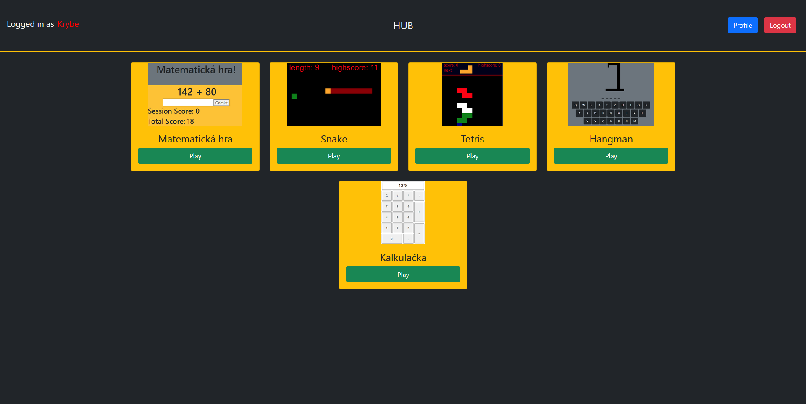
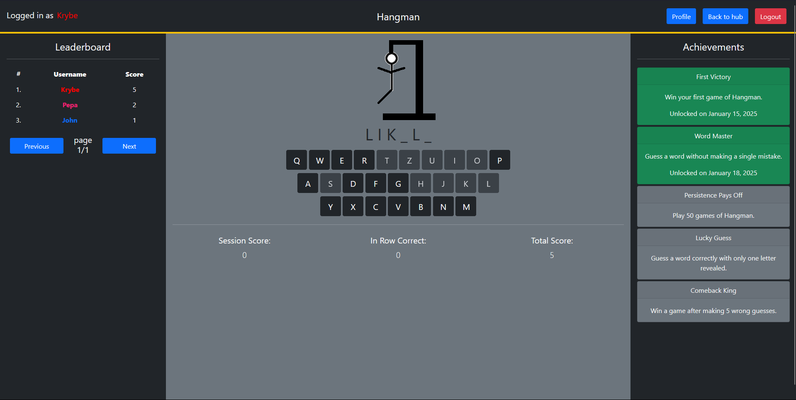
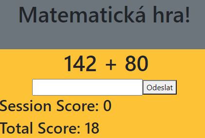
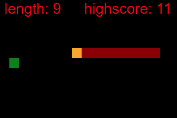
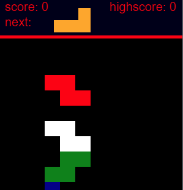
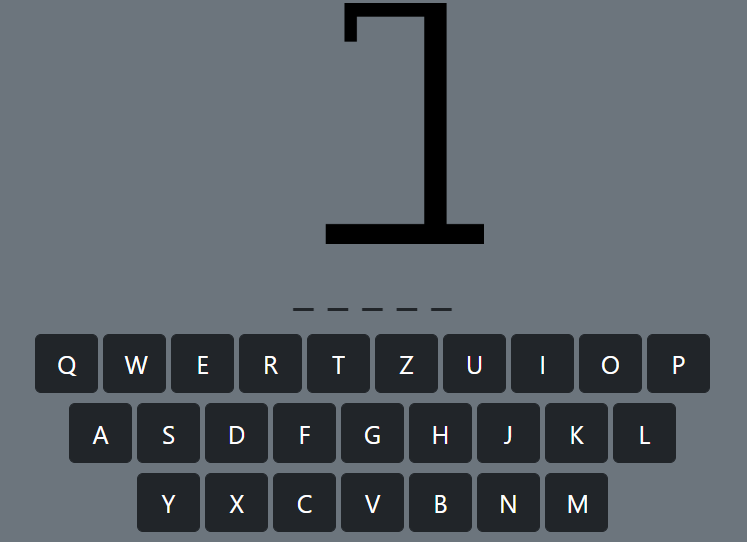

# Webové hry

Projekt webových her inspirovaný platformami jako Superhry. Obsahuje čtyři klasické hry hratelné přímo v prohlížeči.

## Rozhraní
- **Přihlašovací formulář**
  

- **Hlavní stránka**
  

- **Rozhraní hry Hangman**
    
## Dostupné hry

- **Matematická hra** 🧮  
  Trénuj své počítání s rychlými matematickými úlohami.  
    

- **Had** 🐍  
  Klasický Snake – ovládej hada, sbírej body a vyhni se nárazu.  
    

- **Tetris** 🎮 
  Legendární hra s padajícími bloky. Ukládej je chytře a získávej body.  
    

- **Hangman** 🔤  
  Uhodni slovo dřív, než bude pozdě!  
  

